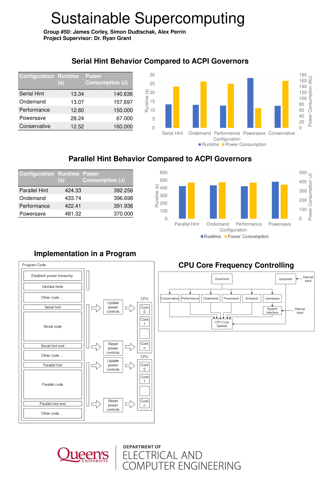
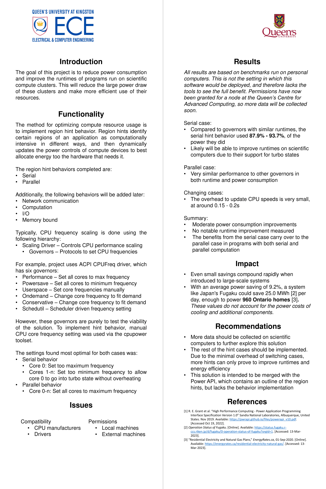

# Sustainable Supercomputing: CPU Power Controls for HPC Efficiency

**ELEC 490/498 Capstone Project, Queen's University**

CPU power management API for dynamic frequency and idle-state control in High-Performance Computing environments, contributing to the [Power API](http://powerapi.sandia.gov/).

## Team

James Corley, Simon Dudtschak, Alex Perrin <br>
**Supervisors:** Dr. Ryan Grant, Dr. Sean Whitehall

## Project Poster




## Project Overview

HPC clusters run diverse workloads across serial algorithms, parallel loops, memory-bandwidth-bound stencils, and I/O-heavy pipelines, often back-to-back on the same hardware. A single static CPU frequency profile cannot serve all workload types efficiently. A serial workload gains nothing from idle cores running at full voltage; a memory-bound kernel gains nothing from a higher clock when the bottleneck is off-chip bandwidth.

This project implements `PWR_AppHintRegion()`, a function from the Power API specification that allows an application to annotate its own execution regions with a semantic hint. The runtime translates each hint into the cpufreq governor profile that best matches the workload's resource demands: maximising the active core's frequency for serial work, parking idle cores in deep C-states, and capping frequency when the CPU is stalled on I/O or memory.

The primary deliverable is a header-only C++ implementation (`pwr_region_hint.hpp`) backed by the Linux `libcpupower` library, validated by two synthetic benchmarks and an automated measurement harness that reports Δtime and Δenergy against a DEFAULT baseline.

**Target hardware:** Intel Xeon E5-2650 v4 @ 2.2 GHz (24 cores), CAC Frontenac HPC cluster.
**Development/validation hardware:** AMD Ryzen 5600X (12 threads).

## Repository

```
capstone/
├── pwr_region_hint.hpp    # Power API: C++ header-only implementation
├── serial_workload.c      # Latency-bound benchmark (inline x86-64 assembly)
├── parallel_workload.c    # Throughput-bound benchmark (OpenMP + AVX2)
├── run_benchmarks.sh      # Automated harness: apply hint, measure, report
├── diagnose.sh            # Diagnostic: verify frequencies and C-state residency
├── results.csv            # Benchmark output log
├── log.csv                # HPC cluster raw data (energy start/stop in µJ)
└── dummy.csv              # Synthetic dataset covering all hint types
```

## Power API Implementation: 

### Usage

Include the `pwr_region_hint.hpp` header.

Call the hint function `PWR_AppHintRegion(PWR_REGION_HINT)` before a section of code.

```cpp
#include "pwr_region_hint.hpp"

int main() {
    PWR_Init();                              // discover hardware frequency bounds once
    PWR_AppHintRegion(PWR_REGION_SERIAL);   // entering a serial region
    run_serial_algorithm();
    PWR_AppHintRegion(PWR_REGION_DEFAULT);  // restore governor control
}
```

### Design

#### `PWR_RegionHint` Enum

```cpp
typedef enum {
    PWR_REGION_DEFAULT       =  0,  // Restore defaults; hint withdrawn
    PWR_REGION_SERIAL        =  1,  // Single-threaded serial execution
    PWR_REGION_PARALLEL      =  2,  // Multi-core parallel execution
    PWR_REGION_COMPUTE       =  3,  // Compute-intensive (treated as PARALLEL)
    PWR_REGION_COMMUNICATE   =  4,  // Network / IPC communication
    PWR_REGION_IO            =  5,  // I/O bound (disk / storage)
    PWR_REGION_MEM_BOUND     =  6,  // Memory bandwidth bound
    PWR_REGION_GLOBAL_LOOP   =  7,  // Outer loop spanning mixed regions
} PWR_RegionHint;
```

### Hardware Discovery: `PWR_Init()`

`PWR_Init()` calls `cpufreq_get_available_frequencies(0)` to walk the linked list of available P-states and find the true hardware maximum. On AMD `acpi-cpufreq`, `cpuinfo_max_freq` reports the base clock and omits boost states; reading `scaling_available_frequencies` returns the complete P-state list including boost. The discovered min and max are stored in two file-scope globals used by all subsequent hint calls.

```cpp
static unsigned long g_hw_min_khz = 0;
static unsigned long g_hw_max_khz = 0;

inline PWR_Status PWR_Init() {
    struct cpufreq_available_frequencies *freqs =
        cpufreq_get_available_frequencies(0);   // returns a heap-allocated linked list

    if (freqs) {
        g_hw_max_khz = 0;
        g_hw_min_khz = ULONG_MAX;
        for (auto *p = freqs; p; p = p->next) {
            if (p->frequency > g_hw_max_khz) g_hw_max_khz = p->frequency;
            if (p->frequency < g_hw_min_khz) g_hw_min_khz = p->frequency;
        }
        cpufreq_put_available_frequencies(freqs);   // caller must free
        if (g_hw_max_khz > 0 && g_hw_min_khz != ULONG_MAX)
            return PWR_RET_SUCCESS;
    }
    // Fallback: drivers that do not expose available frequencies (e.g. amd-pstate active)
    return (cpufreq_get_hardware_limits(0, &g_hw_min_khz, &g_hw_max_khz) == 0)
        ? PWR_RET_SUCCESS : PWR_RET_FAILURE;
}
```

### Frequency Profiles

All frequency targets are expressed as percentages of the `[hw_min, hw_max]` hardware range discovered by `PWR_Init()`, making the implementation portable across CPU generations without hardcoded values.

| Hint          | Core 0           | Cores 1+          |
|---------------|------------------|-------------------|
| `DEFAULT`     | [0%, 100%]       | [0%, 100%]        |
| `SERIAL`      | pinned at 100%   | pinned at 0% + C6 |
| `PARALLEL`    | [75%, 100%]      | [75%, 100%]       |
| `COMPUTE`     | [75%, 100%]      | [75%, 100%]       |
| `COMMUNICATE` | [67%, 100%]      | [0%, 17%]         |
| `IO`          | [-, 67%]         | [-, 67%]          |
| `MEM_BOUND`   | [0%, 33%]        | [0%, 33%]         |
| `GLOBAL_LOOP` | [33%, 75%]       | [33%, 75%]        |

### `setCoreFreq`: Sysfs Write Ordering

Setting both `scaling_min_freq` and `scaling_max_freq` is not commutative. The kernel validates each write against the current limits: a new minimum is clamped to `[hw_min, current_max]` and a new maximum is clamped to `[current_min, hw_max]`. Writing minimum first when it exceeds the current maximum will be rejected. The implementation reads the current policy before writing to determine the correct order.

```cpp
static inline bool setCoreFreq(unsigned int cpu,
                                unsigned long min_khz,
                                unsigned long max_khz) {
    if (!cpupower_is_cpu_online(cpu)) return true;  // skip offline CPUs silently

    if (min_khz == 0 && max_khz == 0) return true;
    if (min_khz == 0) return (cpufreq_modify_policy_max(cpu, max_khz) == 0);
    if (max_khz == 0) return (cpufreq_modify_policy_min(cpu, min_khz) == 0);

    struct cpufreq_policy *cur = cpufreq_get_policy(cpu);
    if (!cur) return false;
    unsigned long cur_max = cur->max;
    cpufreq_put_policy(cur);    // heap-allocated; caller must free

    bool ok = true;
    if (min_khz > cur_max) {
        // New min exceeds current max: raise max first to make room, then raise min
        ok &= (cpufreq_modify_policy_max(cpu, max_khz) == 0);
        ok &= (cpufreq_modify_policy_min(cpu, min_khz) == 0);
    } else {
        // New min fits within current max: lower min first, then adjust max
        ok &= (cpufreq_modify_policy_min(cpu, min_khz) == 0);
        ok &= (cpufreq_modify_policy_max(cpu, max_khz) == 0);
    }
    return ok;
}
```

### C-State Management

For `SERIAL`, parking idle cores at a low P-state alone is insufficient. The cpuidle governor may still hold them in shallow sleep states (POLL/C1) that draw nearly the same power as active. `forceDeepCState` queries the number of available idle states via `cpuidle_state_count` and disables all but the deepest, leaving C6/CC6 (full core power-gate on AMD Zen; C6 on Intel) as the only available option.

```cpp
static inline void forceDeepCState(unsigned int cpu) {
    int count = cpuidle_state_count(cpu);
    for (int s = 0; s < count - 1; s++)
        cpuidle_state_disable(cpu, s, 1);   // 1 = disable
}
```

`enableAllCStates()` (used by `DEFAULT` restore) calls `cpuidle_state_disable(cpu, s, 0)` for all states, where `0` re-enables the state. This reverses any configuration applied by `forceDeepCState`.

## Synthetic Benchmarks

The two workloads target opposite ends of the compute spectrum to validate the `SERIAL` and `PARALLEL` hint profiles against hardware.

### `serial_workload.c`: Latency-Bound, Inline Assembly

The serial workload constructs a chain of fused multiply-add operations where each iteration depends on the result of the previous one, a read-after-write (RAW) hazard. This prevents the CPU's out-of-order engine from parallelising the loop, making execution time proportional to clock latency rather than throughput. The inner loop is written in inline x86-64 assembly to ensure the data dependency survives compiler optimisation passes.

```c
static double serial_kernel(long n, double acc, double mul, double add) {
    __asm__ volatile (
        "vmovsd  %[mul], %%xmm1             \n\t"   // load multiplier into register
        "vmovsd  %[add], %%xmm2             \n\t"   // load addend into register
        "1:                                 \n\t"   // local label for loop target
        "vfmadd132sd %%xmm1, %%xmm2, %[acc]\n\t"   // acc = acc * xmm1 + xmm2
        "dec     %[n]                       \n\t"
        "jnz     1b                         \n\t"
        : [acc] "+x" (acc), [n] "+r" (n)            // read-write operands
        : [mul] "m"  (mul), [add] "m"  (add)        // read-only from memory
        : "xmm1", "xmm2"
    );
    return acc;
}
```

The `VFMADD132SD` `132` encoding computes `dst = dst * src1 + src2`. The destination register is both read and written each cycle, forming the dependency chain. The FMA unit carries a 4-5 cycle latency on modern x86, so the pipeline stalls between every iteration regardless of instruction throughput. The `volatile` qualifier prevents the compiler from eliminating the block when the return value is unused in certain call paths.

```bash
gcc -O2 -mfma -mavx2 -o serial_workload serial_workload.c
```

`-mfma` enables `VFMADD132SD`. `-O2` optimises surrounding C code without touching the `asm volatile` block.

### `parallel_workload.c`: Throughput-Bound, OpenMP + AVX2

The parallel workload exposes two levels of parallelism by eliminating the dependency chain present in the serial workload.

**Within a core (SIMD):** Each thread maintains four independent accumulator streams `s0-s3`. With no data dependency between them, the compiler packs all four `double`-precision operations into a single 256-bit `VFMADD132PD ymm` instruction, computing four doubles per cycle at full AVX2 FMA throughput.

```c
#pragma omp parallel reduction(+:result)
{
    double base = (double)(omp_get_thread_num() + 1);

    // Four distinct starting values prevent the compiler from proving the
    // streams are identical and collapsing them to a single scalar chain.
    double s0 = base,       s1 = base + 0.1,
           s2 = base + 0.2, s3 = base + 0.3;

    for (long i = 0; i < ITERATIONS; i++) {
        s0 = s0 * MUL + ADD;
        s1 = s1 * MUL + ADD;
        s2 = s2 * MUL + ADD;
        s3 = s3 * MUL + ADD;
    }
    result += s0 + s1 + s2 + s3;
}
```

**Across cores (threads):** OpenMP spawns one thread per logical CPU. Each thread runs an independent copy of the four-stream loop with a distinct seed. There are no shared data structures and no synchronisation points in the hot path. The `reduction(+:result)` clause gives each thread a private accumulator and inserts a single barrier-and-sum at loop exit, which is required for correctness.

```bash
gcc -O3 -fopenmp -mfma -mavx2 -o parallel_workload parallel_workload.c
```

`-O3` enables auto-vectorisation, which produces the `ymm` register packing for `s0-s3`.

## Benchmark Harness: `run_benchmarks.sh`

### RAPL Energy Counter Detection

The script probes three energy counter paths in order of preference, covering Intel CPUs, AMD Zen 3+ (kernel 5.17+), and AMD Zen 2+ via the `amd_energy` kernel module. All three expose the counter in microjoules (µJ).

```bash
find_energy_path() {
    [ -f /sys/class/powercap/intel-rapl:0/energy_uj ] \
        && { echo /sys/class/powercap/intel-rapl:0/energy_uj; return; }
    [ -f /sys/class/powercap/amd-rapl:0/energy_uj ] \
        && { echo /sys/class/powercap/amd-rapl:0/energy_uj; return; }
    for p in /sys/class/hwmon/hwmon*/energy1_input; do
        [ -f "$p" ] && { echo "$p"; return; }
    done
    echo ""
}
```

If no counter is found, the script continues timing-only and reports energy columns as `N/A`.

### Hardware Frequency Bounds

The script reads `scaling_available_frequencies` to determine `HW_MAX`, mirroring the approach used by `PWR_Init()`. On `acpi-cpufreq` AMD systems, `cpuinfo_max_freq` reports only the base clock; `scaling_available_frequencies` includes all driver-exposed P-states.

```bash
AVAIL=/sys/devices/system/cpu/cpu0/cpufreq/scaling_available_frequencies
if [ -f "$AVAIL" ]; then
    HW_MAX=$(tr ' ' '\n' < "$AVAIL" | grep -v '^$' | sort -rn | head -1)
else
    HW_MAX=$(cat /sys/devices/system/cpu/cpu0/cpufreq/cpuinfo_max_freq)
fi
```

### `apply_hint()`: cpupower Integration

Frequencies are passed to `cpupower` in kHz with the `KHz` suffix. For `SERIAL`, the C-state configuration mirrors `forceDeepCState` in the C++ API: all available states are enabled first, then all states except the deepest are disabled. The count is read from sysfs at runtime so the logic is correct on any hardware regardless of how many states are exposed.

```bash
SERIAL)
    cpupower -c 0             frequency-set -d "${HW_MAX}KHz" -u "${HW_MAX}KHz"
    cpupower -c "1-$LAST_CPU" frequency-set -d "${HW_MIN}KHz" -u "${HW_MIN}KHz"

    # Disable all C-states except the deepest on idle cores.
    # 3-state hardware (POLL/C1/C2):   disables 0,1   -> leaves C2.
    # 4-state hardware (POLL/C1/C2/C6): disables 0,1,2 -> leaves C6.
    CSTATE_COUNT=$(ls -d /sys/devices/system/cpu/cpu1/cpuidle/state* | wc -l)
    cpupower -c "1-$LAST_CPU" idle-set -E
    for (( _s=0; _s<CSTATE_COUNT-1; _s++ )); do
        cpupower -c "1-$LAST_CPU" idle-set -d "$_s"
    done
    sleep 1   # allow cores to descend through the C-state hierarchy
```

### `measure_run()`: RAPL-Bracketed Timing

Energy is measured by reading the RAPL counter immediately before and after the workload binary. The counter is a monotonically increasing µJ value; the script handles wraparound by consulting `max_energy_range_uj` if the delta is negative. The serial workload is pinned to core 0 with `taskset -c 0` to ensure it runs on the core whose frequency was maximised by the hint.

```bash
measure_run() {
    local binary=$1 cpu=${2:-""}
    [ "$HAVE_ENERGY" -eq 1 ] && e_start=$(cat "$RAPL")
    t_start=$(date '+%s%N')

    if [ -n "$cpu" ]; then
        taskset -c "$cpu" "$binary" > /dev/null
    else
        "$binary" > /dev/null
    fi

    t_end=$(date '+%s%N')
    [ "$HAVE_ENERGY" -eq 1 ] && e_end=$(cat "$RAPL")
    elapsed_ms=$(( (t_end - t_start) / 1000000 ))
    ...
}
```

### `compare()`: Full Measurement Cycle

Each benchmark is run twice in sequence. A `DEFAULT` restore is applied before each measurement and after the pair completes to prevent state leakage between tests.

```
apply_hint DEFAULT -> measure_run -> apply_hint <HINT> -> measure_run -> apply_hint DEFAULT
```

Results are printed to the terminal and appended to `results.csv`:
```
timestamp, benchmark, hint, elapsed_ms, energy_J
```

### Auto-Build

`build_if_needed()` compiles workload binaries if they are missing or if the source is newer than the binary.

```bash
build_if_needed serial_workload.c   serial_workload   "-O2 -mfma -mavx2"
build_if_needed parallel_workload.c parallel_workload "-O3 -fopenmp -mfma -mavx2"
```

## Diagnostic Script: `diagnose.sh`

`diagnose.sh` verifies that the `SERIAL` hint is having the intended hardware effect by sampling CPU state while the serial workload is running. Three conditions are checked independently.

**P-state limits:** prints `scaling_min_freq` and `scaling_max_freq` for every cpufreq-capable CPU after applying the hint.

**Process affinity and placement:** reads the process's affinity mask via `taskset -p PID` and field 39 of `/proc/PID/stat`, which records the last CPU the scheduler placed the process on.

**C-state residency:** snapshots `cpuidle/state*/time` (cumulative µs in each state) on CPUs 1-4, sleeps 1 second, then computes the delta. This shows whether idle cores are reaching deep sleep (C6/CC6) or remaining in shallow states (POLL/C1).

```bash
declare -A time_before
for cpu in 1 2 3 4; do
    for state_dir in /sys/devices/system/cpu/cpu${cpu}/cpuidle/state*; do
        key="cpu${cpu}_$(basename "$state_dir")"
        time_before[$key]=$(cat "$state_dir/time")
    done
done
sleep 1
# compute and print delta_us / 1000 for each state
```

Run standalone before a benchmark session to verify hint behaviour on new hardware:

```bash
sudo ./diagnose.sh
```

## Linux-tools / cpupower / cpufreq Integration

### Library Stack

```
Application (pwr_region_hint.hpp)
    |
    +-- libcpupower  (-lcpupower)
    |       +-- cpufreq.h   P-state control (scaling_min/max_freq sysfs writes)
    |       +-- cpupower.h  CPU online status
    |       +-- cpuidle.h   C-state enable/disable
    |
    +-- sysfs kernel interface
            /sys/devices/system/cpu/cpu*/cpufreq/
            /sys/devices/system/cpu/cpu*/cpuidle/
            /sys/class/powercap/*/energy_uj
```

`libcpupower` is distributed as part of `linux-tools-<kernel-version>`. It wraps sysfs reads and writes with consistent path construction, file locking semantics, and error propagation.

### Key sysfs Files

| File | R/W | Description |
|------|-----|-------------|
| `cpufreq/scaling_min_freq` | R/W | Minimum frequency the governor may select (kHz) |
| `cpufreq/scaling_max_freq` | R/W | Maximum frequency the governor may select (kHz) |
| `cpufreq/scaling_cur_freq` | R | Actual hardware frequency at last sample (kHz) |
| `cpufreq/cpuinfo_min_freq` | R | Absolute hardware minimum (kHz) |
| `cpufreq/cpuinfo_max_freq` | R | Absolute hardware maximum; may omit boost on AMD acpi-cpufreq |
| `cpufreq/scaling_available_frequencies` | R | Space-separated list of all driver-exposed P-states |
| `cpuidle/state*/name` | R | C-state identifier (POLL, C1, C2, C6) |
| `cpuidle/state*/disable` | R/W | Write `1` to disable, `0` to enable |
| `cpuidle/state*/time` | R | Cumulative microseconds spent in this state |
| `powercap/intel-rapl:0/energy_uj` | R | Package energy counter in µJ; wraps at `max_energy_range_uj` |

### Privilege Requirements

All writes to `cpufreq/scaling_*` and `cpuidle/state*/disable` require `CAP_SYS_ADMIN`. Benchmark scripts are run under `sudo`. In an HPC environment, calls would be mediated by a privileged runtime daemon that holds the capability on behalf of user jobs.

### CPU Enumeration

CPUs are enumerated by globbing the sysfs `cpufreq` directories directly. This avoids `nproc`, which may count placeholder entries that have no scaling files.

```bash
FREQ_CPUS=($(ls -d /sys/devices/system/cpu/cpu*/cpufreq 2>/dev/null \
    | grep -oE 'cpu[0-9]+' | grep -oE '[0-9]+' | sort -n))
```

## Results

### HPC Cluster (Intel Xeon E5-2650 v4, CAC Frontenac)

| Hint | Workload | Delta Runtime | Delta Energy |
|------|----------|---------------|--------------|
| `SERIAL` | serial | -0.6% | **-38.9%** |
| `PARALLEL` | parallel | -0.2% | -1.1% |
| `MEM_BOUND` | mem-bound | +1.7% | -4.0% |
| `IO` | I/O bound | +0.6% | -0.3% |
| `COMMUNICATE` | network | -29.7% | -2.9% |

Parking 23 idle cores in C6/CC6 while running the active core at peak P-state delivers a 39% package energy reduction with negligible runtime impact for serial workloads.

### AMD Ryzen 5600X (Development Server)

On this platform `cpufreq_get_available_frequencies` returns three P-states (3700/2800/2200 MHz) and the cpuidle driver exposes only POLL/C1/C2 with no C6/CC6. Hardware boost above the driver maximum is managed by AMD Precision Boost 2 independently of cpufreq. SERIAL hint effects are limited to P-state parking, with C-state savings capped at C2 residency (approximately 2-5% package energy reduction). The cluster results depend on C6/CC6 availability.

## Usage

```bash
# Requirements: linux-tools-<version>, gcc, bc
# Root is required for cpufreq writes.

sudo ./run_benchmarks.sh   # run serial + parallel benchmarks, append to results.csv
sudo ./diagnose.sh         # verify hint hardware effects while workload runs
```

## References

1. R. E. Grant et al., "Standardizing Power Monitoring and Control at Exascale," *Computer*, vol. 49, no. 10, pp. 38-46, Oct. 2016.
2. Power API Specification: http://powerapi.sandia.gov/
3. Linux Kernel Documentation: CPU frequency scaling (`Documentation/cpu-freq/`)
4. Intel 64 and IA-32 Architectures Software Developer's Manual, Vol. 1 §14.5: SIMD Floating-Point Operations

## Acknowledgments

Queen's Centre for Advanced Computing (CAC) for Frontenac cluster access. The Power API development team at Sandia National Laboratories.
